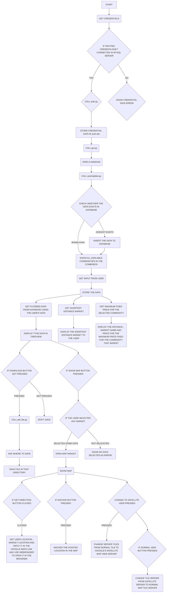

# commodity-price-manager
## A tool for farmers to get way more profit via our project.
This is a project for our class 12 board activity.
<br>

## Agenda :
- What's our project about 
- How we solved it
- How it will be used in real life
- What are the components used
- Conclusion
## What's our project about  :
We are all humans. So we need to eat. We all eat food. Which is grown by farmers. They sell the final product of what they have grown with their hard work. To sell these products they need a place, which is a market. Some markets offer high prices where some are low.
Farmers are unaware of markets which offer high prices. If they sell the commodities at low cost it will lead to loss. 
So to help the farmer we have designed a system which will keep track of the price sold by various markets for various commodities
Farming is the backbone of india. If we help farmers to grow more profit we can grow our country’s economy.
This project ultimately helps farmers to know about the market which offers high price to sell his commodity
## How we solved it :
Problems we had:
- Gather the data of various commodities.
- Storing the collected data for later track back.
- Connecting this data to the user(in this case farmer).
- User visualisation.

1. Gather the data of various commodities :
For this we used a API from [data.gov.in](https://data.gov.in/apis/9ef84268-d588-465a-a308-a864a43d0070) 
Which will provide the required data in json format.


2. Storing the collected data for later track back :
To solve this problem we used the MYSQL database.
So that it will be easy and efficient to store the data and retrieve it.

3. Connecting this data to the user  :
To solve this problem we can use PYTHON. Which has the compatibility to work with MYSQL easily.
It is user friendly and suitable for our project, so we used it.

4. User visualisation : 
We need a way to present our software to the user. It should be a user-friendly solution.There is one way to cover this  problem.We can use a gui. For gui we used the same python but with tkinter. Which is a module in python.
To locate the market which is suggested can be viewed using the geopy module.
Which can be installed by pip install geopy

To use the data offline we can use a module called fpdf which helps to create a pdf which has the data of the market and price in a tabular form . Which the user can use for later use.

## How it will be used in real life :
The farmers can use our project to get profit.They can just enter the commodity they have to sell. Thats it a page opens and suggests some markets which offer the farmers to sell it at high cost.
The user can download the recommended markets and its offered prices or can use the link given to locate the market where they offer a high price for that commodity.
In this way it will be easier for the farmer to sell the commodity.
## What are the components used :
We have used various libraries of python, mysql and api. 
The libraries,api , and languages we used are mentioned below .
- Python
- Mysql 
- [Indian gov api](https://data.gov.in/apis/9ef84268-d588-465a-a308-a864a43d0070)
Python libraries used are mentioned below.
Python libraries used:
- Tkinter
- Tkintermapview
- Requests
- Fpdf
- Mysql-connector    
- Geopy

## How to run the project:
before you run the project you must have installed in you device.
To do that open your terminal or command promt (if you are a windows user) and paste the below command first:<br>
```pip install -r requirements.txt```
<br>
or
<br>
just run the setup.py  from the setup folder.
<br>
For windows
<br>
```python setup.py```
<br>
For linux
<br>
```python3 setup.py```
<br>
If the installation is completed you are now ready to run the project.
To run the project paste  the commands in your terminal: <br>
for linux or mac use: <br>
```python3 auth_gui.py```<br>
For windows use : <br>
```python auth_gui.py```

## Hardware requirements:
- x86 64-bit CPU (Intel / AMD architecture)
- 4 GB RAM (minimum)
- 5 GB free space.
 

## Software requirements :
- Linux , Windows 7 + , Mac .
- Mysql 5.7 (minimum) Mysql 8.0 (maximum)
- Python 3.10.4
- Tkintermapview 1.13
- requests 2.28.1
- fpdf 1.7.2
- customTkinter 4.6.3
- geopy 2.2.0

## Flow chart of our project
<br>

<br>

## Conclusion :
In conclusion we can say that this project is fully based on helping the Indian farmers to get more profit by selling the commodity they have to the market which offers high prices .
Farmers will get more happiness as they deserve to do so.
# Thank you!!


## Developed by:  
- Rakesh
- Pratyush
- Sriram
