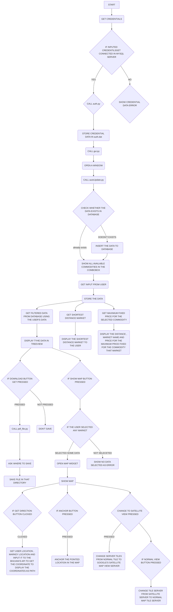

```mermaid
graph TD
A[START] -->B(GET CREDENTIALS)
B --> C{IF INPUTED CREDENTILSGET CONNECTED IN MYSQL SERVER}
C --> | YES | D{CALL auth.py}
C --> | NO | E{SHOW CREDENTIAL DATA ERROR}
D --> F(STORE CREDENTIAL DATA IN auth.dat) --> G(CALL gui.py)
G --> H(OPEN A WINDOW)
H --> I(CALL autoUpdate.py)
I --> J{CHECK WHETHER THE DATA EXISTS IN DATABASE} 
J --> |already exists| K(SHOW ALL AVAILABLE COMMODITIES IN THE COMBOBOX)
J --> |DOESN'T EXISTS| L(INSERT THE DATA TO DATABASE) --> K
K --> M(GET INPUT FROM USER) --> N(STORE THE DATA) --> O(GET FILTERED DATA FROM DATABASE USING THE USER'S DATA)
O --> P(DISPLAY TYHE DATA IN TREEVIEW)
P --> Q{IF DOWNLOAD BUTTON GET PRESSED} --> |PRESSED| R(CALL pdf_file.py) --> S(ASK WHERE TO SAVE)
S --> T(SAVE FILE IN THAT DIRECTORY)
Q --> |NOT PRESSED| V(DON'T SAVE)
P --> U{IF SHOW MAP BUTTON PRESSED} --> CHECKSELECTION{IF THE USER SELECTED ANY MARKET} -->|SELECTED SOME DATA| W(OPEN MAP WIDGET) --> X(SHOW MAP)
X --> Y{IF GET DIRECTION BUTTON CLICKED} --> |CLICKED| Z(GET USER LOCATION , MARKEY LOCATION AND INPUT IT TO THE BHUVAN'S API TO GET THE COORDINATE TO DISPLAY THE COORDINATES AS PATH)
X --> anchor{IF ANCHOR BUTTON PRESSED} --> |PRESSED| ANPT(ANCHOR THE POINTED LOCATION IN THE MAP)
X --> CHAVIEW{CHANGE TO SATELLITE VIEW PRESSED} --> |PRESSED| CHANGE(CHANGE SERVER TILES FROM NORMAL TILE TO GOOGLE'S SATELLITE MAP VIEW SERVER) 
CHAVIEW --> NORVIEW{IF NORMAL VIEW BUTTON PRESSED}  --> NOR(CHANGE TILE SERVER FROM SATELLITE SERVER TO NORMAL MAP TILE SERVER)
N --> GET(GET SHORTEST DISTANCE MARKET) --> DISS(DISPLAY THE SHORTEST DISTANCE MARKET TO THE USER)
N --> GETPRICE(GET MAXIMUM FIXED PRICE FOR THE SELECTED COMMODITY) --> SHOWPRICE(DISPLAY THE DISTANCE , MARKET NAME AND PRICE FOR THE MAXIMUM PRICE FIXED FOR THE COMMODITY THAT MARKET)
CHECKSELECTION --> |NOT SELECETED| SHOER(SHOW NO DATA SELECTED AS ERROR)
```
